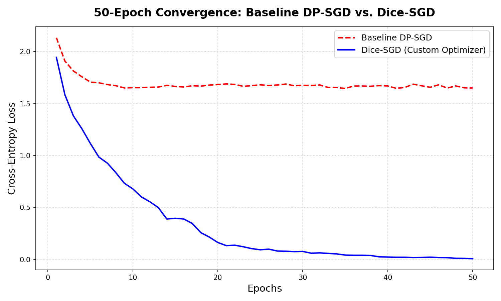

# Mitigating Clipping Bias in DP-SGD via Error Feedback (Dice-SGD)

**Authors:** Priyanshu Agarwal & Sudiksha Singh  
**Institution:** Indian Institute of Technology Madras (Wadhwani School of Data Science and AI)

This repository contains the first open-source, PyTorch-native implementation of **Dice-SGD**, an error-feedback optimization algorithm designed to eliminate clipping bias in Differentially Private Stochastic Gradient Descent (DP-SGD).

## 📌 Project Overview
Standard DP-SGD enforces privacy by clipping the $\ell_2$ norm of per-sample gradients. However, this non-linear clipping operation permanently discards gradient magnitude, introducing a severe optimization bias that degrades convergence and model utility. 

Based on the theoretical framework proposed by Zhang et al. (ICLR 2024), we engineered a custom optimizer that integrates natively with the **Meta Opacus** privacy engine. By storing discarded gradient residuals in a persistent memory buffer and recycling them in subsequent steps, our implementation successfully bridges the gap between strict $(\epsilon, \delta)$-Differential Privacy guarantees and uncompromised model utility.

### 🏆 Key Results
In a strict, hyperparameter-locked 50-epoch benchmark on **CIFAR-10** using a privacy-compliant ResNet-18 architecture, standard DP-SGD stagnated at a loss of `1.65`. Our custom Dice-SGD optimizer successfully recycled clipped residuals to drive the loss down to **`0.007`**, vastly accelerating convergence.



---

## 📂 Repository Structure

```text
PrivAI-Dice-SGD/
├── dice_optimizer.py                      # The standalone PyTorch/Opacus optimizer class
├── notebooks/                             
│   ├── 01_MNIST_Baseline_DP_SGD.ipynb     # Phase 1: Standard DP-SGD baseline
│   ├── 02_DiceSGD_10_Epoch_Demo.ipynb     # Phase 2: Custom optimizer proof-of-concept
│   ├── 03_Hyperparameter_GridSearch.ipynb # Phase 3: 36-configuration robustness testing
│   └── 04_CIFAR10_50_Epoch_Benchmark.ipynb# Phase 4: The final 50-epoch CIFAR-10 evaluation
├── results/                               
│   ├── grid_search_results.csv            # Raw empirical data from Phase 3
│   └── *.png                              # Benchmark visualizations
└── reports/                               
    └── PrivAI_Final_Report.pdf            # The comprehensive 8-page academic paper

```

---

## 🚀 How to Use `DiceSGDOptimizer`

We designed the optimizer to be a plug-and-play extension for the Opacus library.

**Dependencies:**

```bash
pip install torch torchvision opacus

```

**Quickstart Code:**

```python
import torch
from opacus import PrivacyEngine
from dice_optimizer import DiceSGDOptimizer

# 1. Initialize standard PyTorch model and optimizer
model = MyModel()
base_optimizer = torch.optim.SGD(model.parameters(), lr=0.01, momentum=0.5)

# 2. Attach standard Opacus Privacy Engine
privacy_engine = PrivacyEngine(accountant="rdp")
model, optimizer, train_loader = privacy_engine.make_private(
    module=model,
    optimizer=base_optimizer,
    data_loader=train_loader,
    noise_multiplier=0.5,
    max_grad_norm=1.0,
)

# 3. Inject the Dice-SGD Error Feedback Mechanism!
dice_optimizer = DiceSGDOptimizer(
    optimizer=optimizer.original_optimizer,
    noise_multiplier=optimizer.noise_multiplier,
    max_grad_norm=optimizer.max_grad_norm,
    expected_batch_size=optimizer.expected_batch_size
)
# Transfer the state from the Opacus wrapper to Dice-SGD
dice_optimizer.state = optimizer.state 

# 4. Train as normal. The step() function handles the pre-clipping error injection automatically.
for images, labels in train_loader:
    dice_optimizer.zero_grad()
    loss = criterion(model(images), labels)
    loss.backward()
    dice_optimizer.step() # <--- Error feedback occurs here!

```

---

## ⚙️ Hardware & Engineering Notes

Implementing error feedback introduces a ~3x VRAM overhead, as the optimizer must simultaneously store unclipped gradients, clipped updates, and the persistent error buffer. To prevent OOM failures on standard hardware (e.g., NVIDIA T4 16GB GPUs), we recommend:

1. Limiting maximum batch size (e.g., $B \leq 64$).
2. Replacing `BatchNorm` layers with `GroupNorm` to ensure sample independence while managing memory efficiently.

## 📖 Acknowledgements

This project was completed as part of the PrivAI Course at IIT Madras under the guidance of Prof. Krishna Pillutla. The theoretical foundation of the error-feedback mechanism is attributed to Zhang et al., *Eliminating Clipping Bias in DP-SGD* (ICLR 2024).